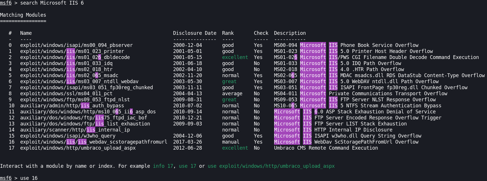

# Granny Write-Up (English Version)
This is my write-up about **Granny** which is a retired Windows machine on **Hack The Box** having the IP Address `10.10.10.15`.

 

## Target Enumeration

### Nmap Initial Scan
---

I first started by doing my usual type of **Nmap** scan, which is a SYN scan, scanning for service version and running the default `NSE script` of **Nmap**
 

Note : SYN scan require you to perform the command as `root`

As we can see in the **Nmap** output, seems like WebDav is running there and it allows **HTTP PUT** method onto the server. So we could abuse that or to search exploits for `Microsoft IIS 6.0` in **Metasploit**

 

## Getting a Foothold

### The HTTP Method (Without Metasploit)
---

We now have to find which file extension we can upload onto the webserver with the **PUT** method. We could try some extensions individually with **Burp suite**, but instead we are going to use **davtest** since we have **WebDav** running.

From this we can see that the upload only worked by uploading **.html** and **.txt** files.
Our **Nmap** scan also revealed that there was an HTTP method **MOVE** also. Maybe we could upload a simple **.txt** file and moving it into **.aspx**.

Let's generate a reverse **aspx** meterpreter shell payload with **msfvenom**

Next, let's start **Burp suite** and capture a request from the home page and send it into the **Repeater** tab to edit it. We will try to upload a text file called `notmalicious.txt` and if it succeeds we will try to change its extension name. 

Let's send the request ! As we can see the file was created.

If we visit the website with our filename in the address bar we can see the content of our file reflecting our **msfvenom** payload.

So now, we only have to change the file extension to **aspx** to make the code executable by the webserver.

And it worked!

Now let's start **msfconsole**

And let's use `exploit/multi/handler` to be able to catch or **meterpreter** shell when we will type or filename in the address bar.

 

### The Metasploit way
---
Start **msfconsole**

We know that `Microsoft IIs 6.0` is running on our target machine, so let's search some exploits for it

We can see that the exploit #16 is for **WebDav** which we know is running on the webserver. So let's use #16 and try to exploit our target with it.

As we can see in the screenshot above, our shell seems to be from an unstable process. We don't have enough privileges. So we can list the processes and try to spot a more stable one to try to migrate to.

Now let's try to migrate

 

## Privilege Escalation
---

We can run the `local_exploit_suggester` module into our meterpreter session to enumerates potential exploits to use for our target. In my case is revealed that it was vulnerable to `ms14_070`. So let's search for it in **Metasploit**.

Now we only need to set the exploit and try it on our target.

And we got a meterpreter shell back and we are **SYSTEM** so we owned it.
Let's search for the flags now and we are done.

